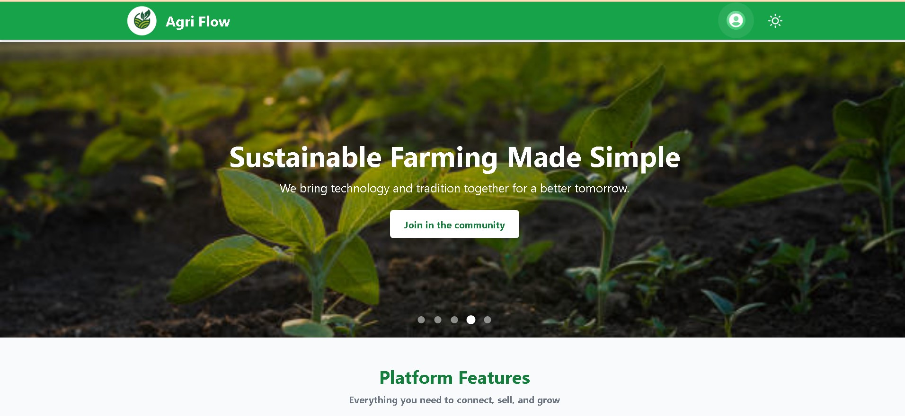

# AgriFlow

**AgriFlow** is a modern farmer community platform that helps farmers connect, communicate, collaborate, and grow together. Built with **React**, **Django Rest Framework**, and **WebSockets**, AgriFlow enables real-time messaging, community building, event coordination, and product exchange between farmers.

  

---

## 🚀 Features

### 👨‍🌾 Farmer Community & Social Networking
- Create and manage user profiles for farmers.
- Connect with other farmers in your area or across regions.
- View nearby farmers using location-based services.

### 💬 Real-time Chat System (WebSocket Powered)
- **1:1 Chat** — Farmer to farmer direct messaging.
- **Group Chat** — Community group creation and interaction.
- **Product Chat** — OLX-like buyer-seller conversations with media support.
- **Media Sharing** — Send images, files, and documents in chat.
- **Typing & Seen indicators**, with socket-based real-time updates.

### 📅 Event Management
- Organize **offline** or **online events** (e.g., farming workshops, exhibitions).
- RSVP and join events within the platform.
- Share event links or manage participant lists.

### 🛒 Product Selling Portal
- Post products for sale (tools, crops, seeds).
- In-app product page with seller chat integration.
- Location-based recommendations and listings.

### 🔔 Notification System
- Realtime in-app notifications via WebSockets.
- Message alerts, event invites, group mentions.
- Notification tray and read/unread status.

---

## 🛠️ Tech Stack

| Tech        | Purpose                            |
|-------------|-------------------------------------|
| 🐍 Python    | Backend logic                      |
| 🧰 Django    | Core web framework                 |
| ⚙️ Django REST Framework | API development     |
| 🌐 React     | Frontend SPA                       |
| 💨 Tailwind CSS | Utility-first CSS styling     |
| 🎨 DaisyUI   | UI
