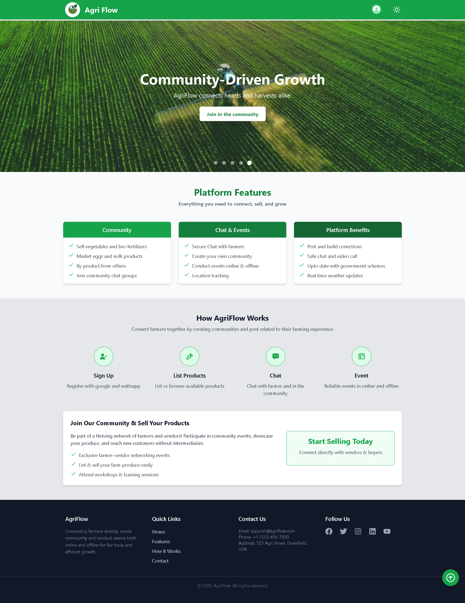

# AgriFlow

**AgriFlow** is a modern farmer community platform that helps farmers connect, communicate, collaborate, and grow together. Built with **React**, **Django Rest Framework**, and **WebSockets**, AgriFlow enables real-time messaging, community building, event coordination, and product exchange between farmers.
<p align="center">
  
</p>

---

## 🚀 Features

### 👨‍🌾 Farmer Community & Social Networking
- Create and manage user profiles for farmers.
- Connect with other farmers in your area or across regions.
- View nearby farmers using location-based services.

### 💬 Real-time Chat System (WebSocket Powered)
- **1:1 Chat** — Farmer to farmer direct messaging.
- **Group Chat** — Community group creation and interaction.
- **Product Chat** — OLX-like buyer-seller conversations with media support.
- **Media Sharing** — Send images, files, and documents in chat.
- **Typing & Seen indicators**, with socket-based real-time updates.

### 📅 Event Management
- Organize **offline** or **online events** (e.g., farming workshops, exhibitions).
- RSVP and join events within the platform.
- Online event with Zego Cloud API implimentation
- Share event links or manage participant lists.

### 🛒 Product Selling Portal
- Post products for sale (tools, crops, seeds).
- In-app product page with seller chat integration.

### 🔔 Notification System
- Realtime in-app notifications via WebSockets.
- Message alerts, event invites, group mentions.
- Notification tray and read/unread status.

---
## 🧩 Installation & Setup

### ⚙️ Prerequisites

Before you begin, make sure you have the following installed:

### 📦 General
- [Git](https://git-scm.com/) – for cloning the repository

### 🐳 Backend (Docker)
- [Docker Desktop](https://www.docker.com/products/docker-desktop) – required for running backend containers
  
  > ⚠️ Make sure Docker Desktop is running before you start the backend.
  
- [Docker Compose](https://docs.docker.com/compose/install/) – usually included with Docker Desktop

### 🌐 Frontend (Vite + React)
- [Node.js (v16+)](https://nodejs.org/) – runtime environment for running the frontend
- [npm](https://www.npmjs.com/) – comes with Node.js, for installing packages


- 📁 Clone the Repository
  
  ```
  git clone https://github.com/VishnuCheruvakkara/AgriFlow-Community-web-app.git
  cd AgriFlow-Community-web-app
  ```
### 📀 Backend (Using docker)

1. Navigate to backend directory :
   ```
   cd back_end
   ```
2. Build All Docker Images :
   ```
   docker-compose build
   ```
   
   > This will read the docker-compose.yml file and build the backend using their respective     Dockerfiles.
   
 3.  Start the Project :
   ```
   docker-compose up -d
   ```

   > The backend (Django server) will now be running at http://localhost:8000.

### 🌐 Frontend Setup (Manual) : 
1. Navigate to Frontend Directory :
     ```
     cd front_end 
     ```
2. Install Frontend Dependencies :
     ```
    npm install
     ```
1.  Start Frontend Server:
     ```
     npm run dev
     ```
     
     > The frontend (Vite server) will now be running at http://localhost:5173.


